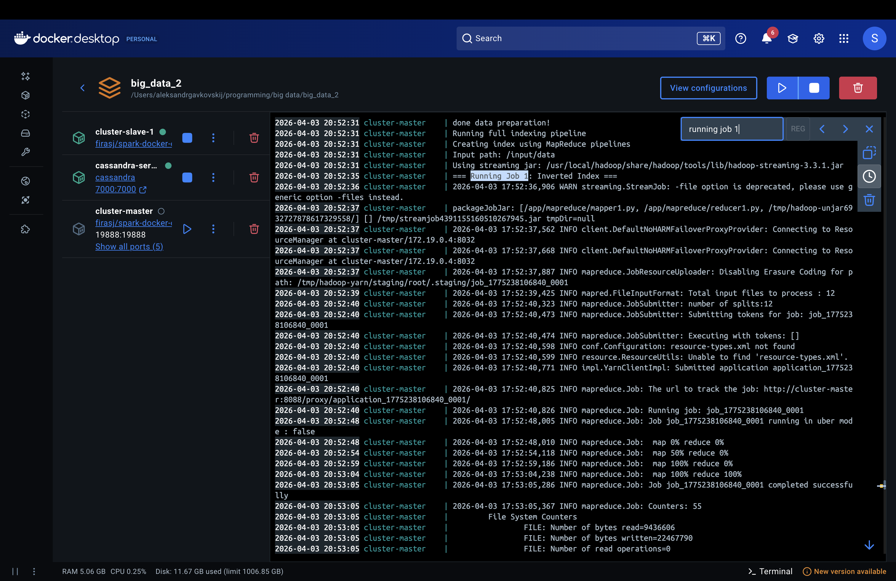
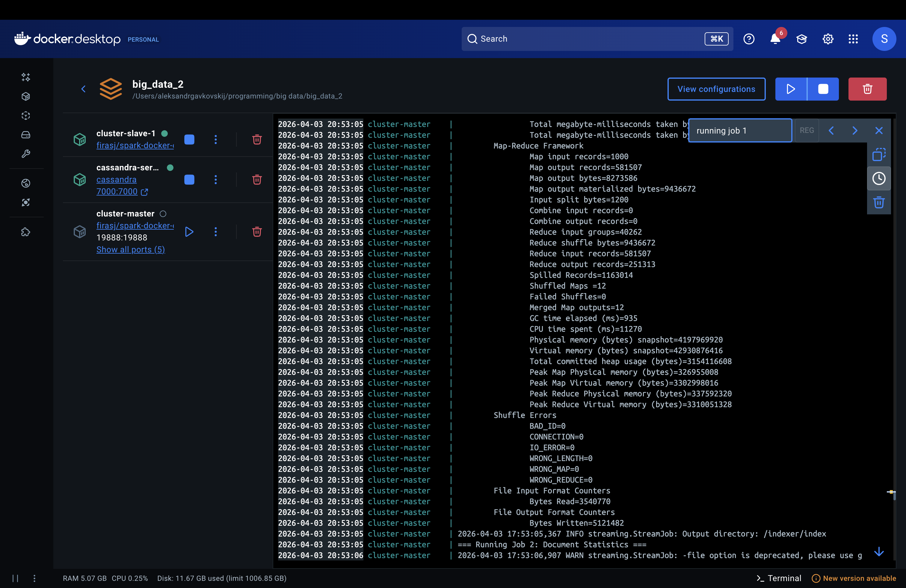
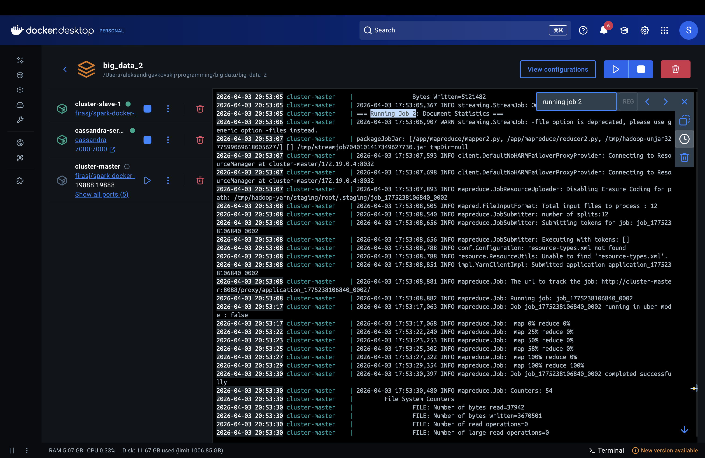
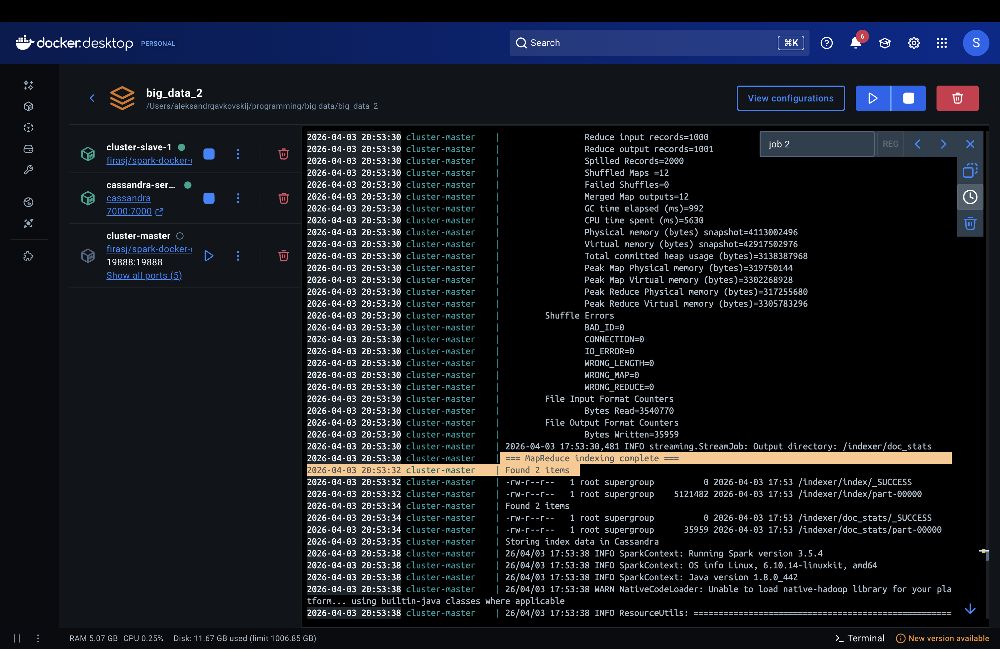
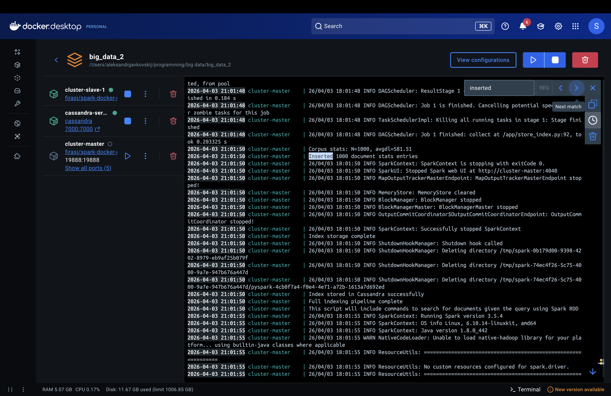
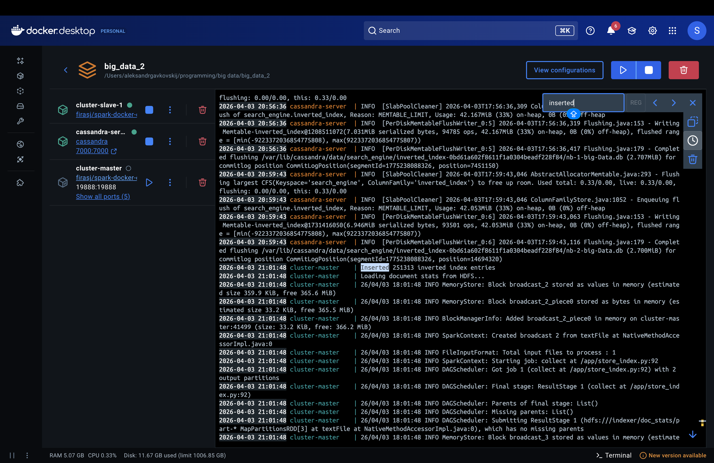
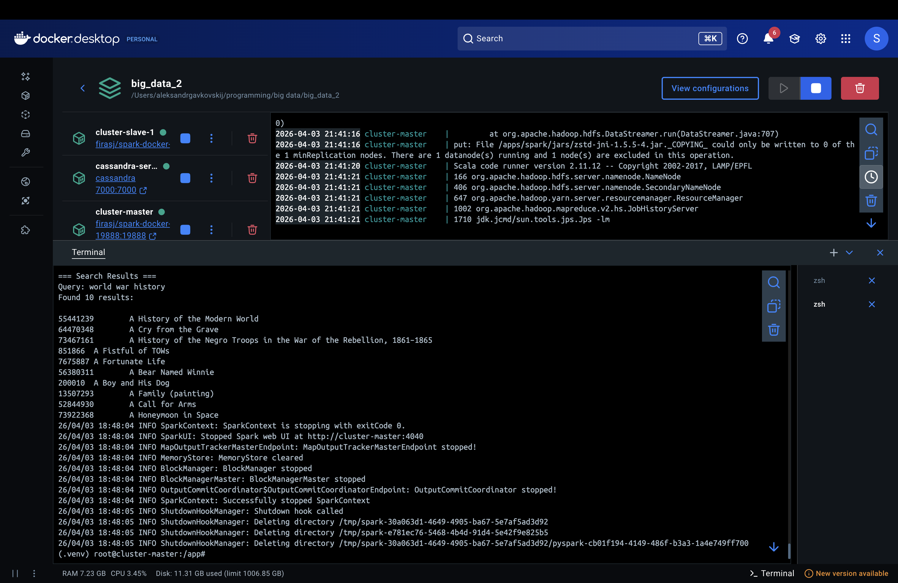
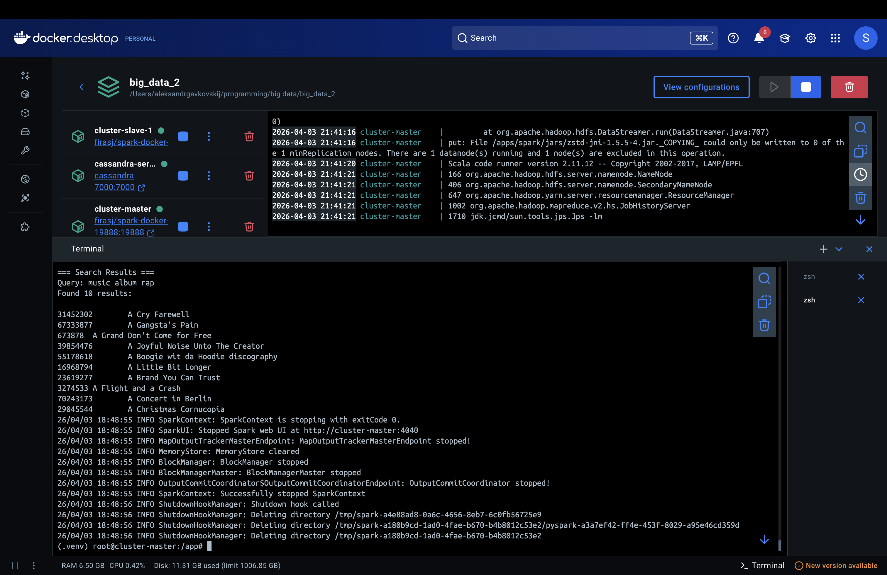
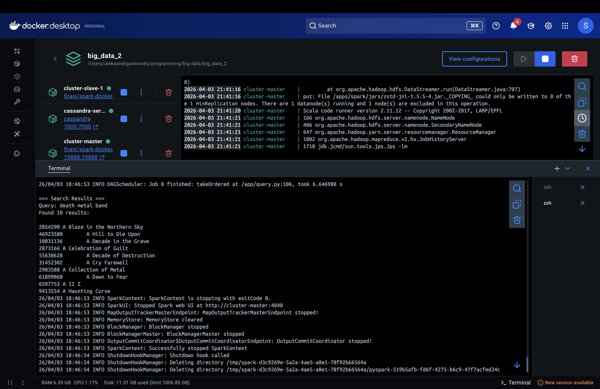

# Assignment 2: Simple Search Engine using Hadoop MapReduce

**Author**: Aleksandr Gavkovskii

**Repository**: [https://github.com/SachaYT1/big_data_2](https://github.com/SachaYT1/big_data_2)

## Section 1: Methodology

### 1.1 System Architecture

The search engine consists of three main stages:

1. **Data Preparation** — 1000 Wikipedia documents are converted into tab-separated format (`doc_id\ttitle\ttext`) and uploaded to HDFS at `/input/data`
2. **Indexing** — Two Hadoop MapReduce jobs build an inverted index and document statistics, which are then stored in Cassandra
3. **Ranking** — A PySpark application queries the Cassandra index and ranks documents using BM25

```
Wikipedia .txt files (1000 docs)
    → prepare_data.sh → HDFS /input/data (tab-separated)
    → create_index.sh → MapReduce Job 1 (Inverted Index) → HDFS /indexer/index
                       → MapReduce Job 2 (Doc Stats)      → HDFS /indexer/doc_stats
    → store_index.sh  → Cassandra tables
    → search.sh       → BM25 ranking → Top 10 results
```

### 1.2 MapReduce Pipeline Design

We use two MapReduce pipelines executed via Hadoop Streaming.

#### Pipeline 1: Inverted Index

**Purpose**: For each term, determine which documents contain it, how many times (tf), and in how many documents it appears (df).

**Mapper (`mapper1.py`)**:
- Reads each line: `doc_id\ttitle\ttext`
- Tokenizes text: converts to lowercase, removes non-alphanumeric characters, splits by whitespace
- Emits: `term\tdoc_id` for each token occurrence

**Reducer (`reducer1.py`)**:
- Receives sorted `term\tdoc_id` pairs
- Groups by term, counts occurrences per document → tf (term frequency)
- Counts distinct documents per term → df (document frequency)
- Emits: `term\tdoc_id\ttf\tdf`

**Output**: HDFS `/indexer/index/`

#### Pipeline 2: Document Statistics

**Purpose**: Compute document lengths and corpus-level statistics (N, avgdl) needed for BM25.

**Mapper (`mapper2.py`)**:
- Reads each line: `doc_id\ttitle\ttext`
- Tokenizes text using the same function as mapper1 (consistency is critical)
- Counts total tokens → doc_length
- Emits: `doc_id\ttitle\tdoc_length`

**Reducer (`reducer2.py`)**:
- Passes through each document's stats
- Accumulates total document count (N) and total word count
- After processing all input, emits a special line: `__CORPUS__\tN\tavgdl`
- **Uses a single reducer** (`-D mapreduce.job.reduces=1`) to ensure global statistics are computed correctly

**Output**: HDFS `/indexer/doc_stats/`

#### Tokenization

All components (mapper1, mapper2, query.py) use identical tokenization to ensure consistency:

```python
import re
def tokenize(text):
    return re.sub(r'[^a-z0-9\s]', ' ', text.lower()).split()
```

This converts text to lowercase, replaces all non-alphanumeric characters with spaces, and splits into tokens.

### 1.3 Cassandra Database Schema

We designed three tables in the `search_engine` keyspace:

#### Table 1: `inverted_index`
```sql
CREATE TABLE inverted_index (
    term text,
    doc_id text,
    tf int,
    df int,
    PRIMARY KEY (term, doc_id)
);
```
**Design rationale**: Partitioned by `term` with `doc_id` as clustering column. A query `SELECT * FROM inverted_index WHERE term = 'X'` retrieves all postings for a term in a single partition read — exactly what BM25 needs. This is the most performance-critical table since it is queried once per query term.

#### Table 2: `doc_stats`
```sql
CREATE TABLE doc_stats (
    doc_id text PRIMARY KEY,
    title text,
    doc_length int
);
```
**Design rationale**: Partitioned by `doc_id` for O(1) lookup of any document's length and title. Used during BM25 scoring to normalize term frequencies by document length.

#### Table 3: `corpus_stats`
```sql
CREATE TABLE corpus_stats (
    id int PRIMARY KEY,
    num_docs int,
    avg_doc_length float
);
```
**Design rationale**: Single-row table (id=1) holding corpus-wide statistics. These values are constant for a given index and are fetched once per query.

### 1.4 BM25 Implementation

BM25 (Best Matching 25) is a ranking function that scores documents based on query term frequency, document length, and corpus statistics.

**Formula**:

```
BM25(q, d) = Σ(t ∈ q) log(N / df(t)) × ((k1 + 1) × tf(t,d)) / (k1 × ((1 - b) + b × (dl(d) / avgdl)) + tf(t,d))
```

Where:
- **N** — total number of documents in the corpus
- **df(t)** — number of documents containing term t
- **tf(t,d)** — frequency of term t in document d
- **dl(d)** — length of document d (in tokens)
- **avgdl** — average document length across the corpus
- **k1 = 1.0** — controls term frequency saturation (higher values give more weight to repeated terms)
- **b = 0.75** — controls document length normalization (1.0 = full normalization, 0.0 = no normalization)

**Implementation details** (`query.py`):
1. The query string is tokenized using the same function as the mappers
2. For each unique query term, postings are fetched from Cassandra's `inverted_index` table
3. Candidate documents (those containing at least one query term) are collected
4. Document lengths are fetched from `doc_stats`
5. BM25 scores are computed using PySpark RDD API (`sc.parallelize` → `.map` → `.takeOrdered`)
6. Top 10 results are returned sorted by descending score

### 1.5 Component Interaction

The full pipeline is orchestrated by `app.sh`:

1. `start-services.sh` — starts HDFS, YARN, MapReduce History Server
2. Virtual environment is created and dependencies installed
3. `prepare_data.sh` — uploads documents to HDFS, creates tab-separated format via PySpark
4. `index.sh` calls:
   - `create_index.sh` — runs two Hadoop Streaming MapReduce jobs
   - `store_index.sh` — reads HDFS output via PySpark, loads into Cassandra
5. `search.sh` — executes `query.py` via `spark-submit`

---

## Section 2: Demonstration

### 2.1 How to Run

**Prerequisites**:
- Docker and Docker Compose installed
- **Docker Desktop Memory**: at least 6-8 GB (Settings → Resources → Memory)
- **Docker Desktop Disk**: at least 30 GB (Settings → Resources → Disk image size)
- **macOS**: disable AirPlay Receiver to free port 7000 (System Settings → General → AirDrop & Handoff → AirPlay Receiver → OFF)

```bash
git clone https://github.com/SachaYT1/big_data_2.git
cd big_data_2
docker compose up
```

This starts three containers:
- `cluster-master` — Hadoop/Spark master node (runs the full pipeline)
- `cluster-slave-1` — Hadoop worker node
- `cassandra-server` — Cassandra database

The pipeline runs automatically: data preparation → MapReduce indexing → Cassandra storage → test search query. After completion, the container stays alive for interactive queries:

```bash
docker exec -it cluster-master bash -c "cd /app && source .venv/bin/activate && bash search.sh '<your query>'"
```

**Note**: `docker compose down` removes container data (HDFS, Cassandra). A full re-run of `docker compose up` will re-execute the entire pipeline.

### 2.2 Successful Indexing

**MapReduce Job 1 (Inverted Index)** started and completed successfully, processing all 1000 documents:





**MapReduce Job 2 (Document Statistics)** completed with a single reducer, computing corpus-level statistics:





**Cassandra loading** — the index was successfully stored in all three tables. A total of 251,313 inverted index entries and 1000 document stats entries were inserted:





### 2.3 Search Queries and Results

#### Query 1: "world war history"



```
55441239        A History of the Modern World
64470348        A Cry from the Grave
73467161        A History of the Negro Troops in the War of the Rebellion, 1861–1865
851866          A Fistful of TOWs
7675887         A Fortunate Life
56380311        A Bear Named Winnie
200010          A Boy and His Dog
13507293        A Family (painting)
52844930        A Call for Arms
73922368        A Honeymoon in Space
```

**Analysis**: The top results are highly relevant. "A History of the Modern World" and "A History of the Negro Troops in the War of the Rebellion" rank highest because they contain all three query terms ("world", "war", "history") with high term frequencies. "A Cry from the Grave" — a documentary about the Srebrenica massacre — ranks second due to frequent mentions of "war" and "history". Documents like "A Fistful of TOWs" (a war game) and "A Call for Arms" appear lower because they match fewer query terms but still have high tf for "war".

#### Query 2: "music album rap"



```
31452302        A Cry Farewell
67333877        A Gangsta's Pain
673878          A Grand Don't Come for Free
39854476        A Joyful Noise Unto The Creator
55178618        A Boogie wit da Hoodie discography
16968794        A Little Bit Longer
23619277        A Brand You Can Trust
3274533         A Flight and a Crash
70243173        A Concert in Berlin
29045544        A Christmas Cornucopia
```

**Analysis**: The results correctly surface music-related articles. "A Gangsta's Pain" (Moneybagg Yo's rap album) and "A Boogie wit da Hoodie discography" rank high because they contain frequent occurrences of "album", "music", and "rap". "A Grand Don't Come for Free" (The Streets' album) appears due to high tf for "album" and "music". BM25's IDF component gives extra weight to "rap" since it appears in fewer documents than "music" or "album", which helps prioritize rap-specific articles over general music ones.

#### Query 3: "death metal band"



```
2054290         A Blaze in the Northern Sky
46923580        A Hill to Die Upon
10031136        A Decade in the Grave
2873166         A Celebration of Guilt
55638628        A Decade of Destruction
31452302        A Cry Farewell
2983588         A Collection of Metal
61899060        A Dawn to Fear
6597753         A II Z
9413554         A Haunting Curse
```

**Analysis**: The results are very relevant to the query. "A Blaze in the Northern Sky" (Darkthrone's iconic black/death metal album) ranks first due to high combined tf for all three terms. "A Hill to Die Upon" and "A Decade in the Grave" (Six Feet Under box set) follow closely — both are articles about death metal bands with frequent mentions of "death", "metal", and "band". "A Celebration of Guilt" (Arsis album) and "A Collection of Metal" also rank high due to strong term overlap. The BM25 document length normalization (b=0.75) helps shorter, focused articles about specific bands rank above longer, more general articles.

### 2.4 Reflections

Overall, the search results were relevant for all three queries. For "death metal band", the top results were actual death metal albums and compilations, which makes sense. For "music album rap", we got rap albums and discographies. For "world war history", most results were clearly related to wars and history.

BM25 handles multi-word queries well because it sums up scores for each query term separately. So a document that matches all three words gets a much higher score than one matching just one. Also, rare words like "rap" or "death" contribute more to the score than common words like "music" — this is the IDF part of the formula doing its job.

One thing I noticed is that some results for "world war history" (like "A Bear Named Winnie" or "A Boy and His Dog") seem unrelated at first, but they actually do mention wars in their text. This shows that BM25 is a statistical method — it counts words, it does not understand meaning. If a document mentions "war" enough times, it will rank high regardless of what the article is actually about.

Document length normalization (b=0.75) also had a visible effect — shorter focused articles ranked higher than long general ones, because BM25 adjusts for the fact that longer documents naturally contain more word occurrences.
